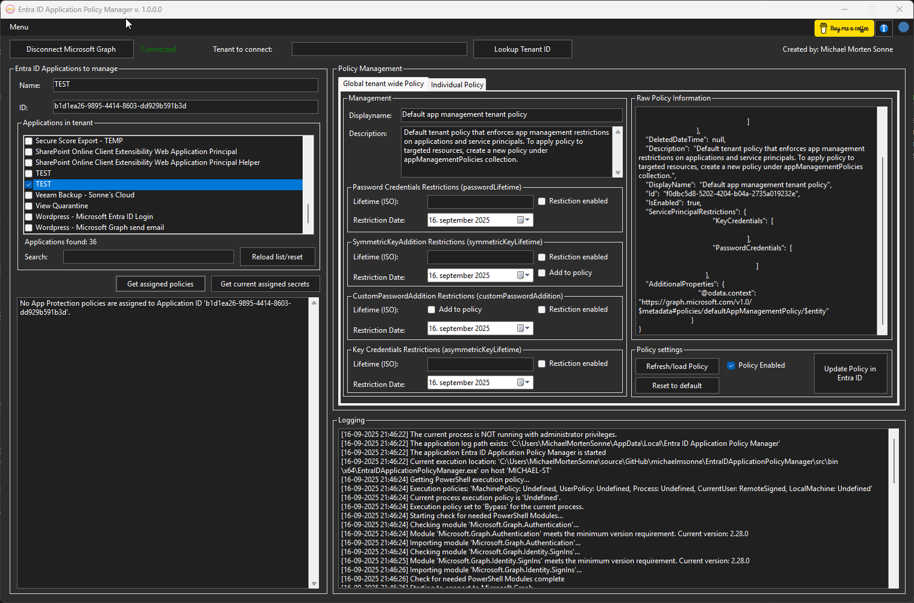

# EntraIDApplicationPolicyManager

<p align="center">
  <a href="https://www.linkedin.com/in/michaelmsonne/"></a>
  <a href="https://github.com/michaelmsonne/EntraIDApplicationPolicyManager"></a>
  <a href="https://github.com/michaelmsonne/EntraIDApplicationPolicyManager"></a>
  <a href="https://github.com/michaelmsonne/EntraIDApplicationPolicyManager"></a><br>
  <a href="https://www.buymeacoffee.com/sonnes" target="_blank"></a>
</p>

<div align="center">
  <a href="https://github.com/michaelmsonne/EntraIDApplicationPolicyManager/issues/new?assignees=&labels=bug&template=01_BUG_REPORT.md&title=bug%3A+">Report a Bug</a>
  ·
  <a href="https://github.com/michaelmsonne/EntraIDApplicationPolicyManager/issues/new?assignees=&labels=enhancement&template=02_FEATURE_REQUEST.md&title=feat%3A+">Request a Feature</a>
  .
  <a href="https://github.com/michaelmsonne/EntraIDApplicationPolicyManager/discussions">Ask a Question</a>
</div>

<div align="center">
<br />

</div>

## Table of Contents
- [Introduction](#introduction)
- [Contents](#contents)
- [Features](#features)
- [Download](#download)
- [Getting Started](#getting-started)
  - [Prerequisites](#prerequisites)
  - [Installation](#installation)
- [Usage](#usage)
- [Examples](#examples)
- [Contributing](#contributing)
- [Status](#status)
- [Support](#support)
- [License](#license)
- [Credits](#credit)

# Introduction
EntraIDApplicationPolicyManager is a Windows and PowerShell-based tool designed to help IT administrators manage, audit, and enforce application management policies in Microsoft Entra ID.

With a modern graphical interface, it enables:
- Tenant-wide and per-app policy management
- Certificate and secret overview with expiry details (to-do)
- Real-time logging and raw policy data inspection
- Date-based restriction enforcement
- Direct policy updates from Entra ID
- more...

Whether you need to secure sensitive apps, audit legacy configurations, or automate policy compliance, this tool makes Entra ID application policy management effortless, visual, and secure.

## Contents

Outline the file contents of the repository. It helps users navigate the codebase, build configuration and any related assets.

| File/folder       | Description                                 |
|-------------------|---------------------------------------------|
| `src`             | Source code.                                |
| `.gitignore`      | Define what to ignore at commit time.       |
| `CHANGELOG.md`    | List of changes to the sample.              |
| `CONTRIBUTING.md` | Guidelines for contributing to the EntraIDApplicationPolicyManager.|
| `README.md`       | This README file.                           |
| `SECURITY.md`     | SECURITY file.                              |
| `LICENSE`         | The license for the EntraIDApplicationPolicyManager.               |

## 🚀 Features

### Overall:
- Asynchronous resolution for improved performance and responsiveness.
- Simple and easy-to-use.

🤝 Free & Community-Driven - Open-source, with features shaped by your feedback!

### List:
- Core Functionality:
  - The tool provides the ability to manaage Tenant-Wide Policy Management and Per-App Policy Management (in progress)
  - Raw Policy JSON Viewer
  - Real-Time Logging
  - Date-Based Restriction Enforcement
  - Built-In Policy Enabler Toggle
  - Direct Policy Load/Update

- User Interface:
  - The tool includes a user-friendly graphical interface.

more to come...

## Download

[Download the latest version](../../releases/latest)

[Version History](CHANGELOG.md)

## ⚡ Getting Started
### 🛠 Prerequisites
- [PowerShell 5 or 7](https://github.com/PowerShell/PowerShell) installed.
- Microsoft Graph PowerShell module: Microsoft.Graph.Authentication and Microsoft.Graph.Identity.SignIns
  Install via  
  ```powershell
  Install-Module <name> -Scope CurrentUser
  ```

### Installation
You can either clone this repository and build the project yourself or use the provided installer.

## Usage

### 🔧 How to Use

1. **Launch the Tool**.
2. Login to Microsoft Graph

# 📸 Screenshots

# Main UI:

**Layout:**




# 🧪 Testing

- Tested on Windows 10 and 11 (Pro & Enterprise)
- Validated on endpoints joined to AD and Intune

## Building

For now the tool is created in PowerShell Studio - therefor, a need 🤣

# Contributing
If you want to contribute to this project, please open an issue or submit a pull request. I welcome contributions :)

See [CONTRIBUTING](CONTRIBUTING) for more information.

First off, thanks for taking the time to contribute! Contributions are what makes the open-source community such an amazing place to learn, inspire, and create. Any contributions you make will benefit everybody else and are **greatly appreciated**.
Feel free to send pull requests or fill out issues when you encounter them. I'm also completely open to adding direct maintainers/contributors and working together! :)

Please try to create bug reports that are:

- _Reproducible._ Include steps to reproduce the problem.
- _Specific._ Include as much detail as possible: which version, what environment, etc.
- _Unique._ Do not duplicate existing opened issues.
- _Scoped to a Single Bug._ One bug per report.´´

# Status

The project is actively developed and updated.

# Support

Commercial support

This project is open-source and I invite everybody who can and will to contribute, but I cannot provide any support because I only created this as a "hobby project" ofc. with tbe best in mind. For commercial support, please contact me on LinkedIn so we can discuss the possibilities. It’s my choice to work on this project in my spare time, so if you have commercial gain from this project you should considering sponsoring me.

<a href="https://www.buymeacoffee.com/sonnes" target="_blank"></a>

Thanks.

Reach out to the maintainer at one of the following places:

- [GitHub discussions](https://github.com/michaelmsonne/EntraIDApplicationPolicyManager/discussions)
- The email which is located [in GitHub profile](https://github.com/michaelmsonne)

## From/in the community

- [Teaser 2](https://www.linkedin.com/posts/michaelmsonne_microsoft-powershell-entraid-activity-7339739861966323715-e29y?utm_source=share&utm_medium=member_desktop&rcm=ACoAAA4IH1oB8PMrp55sL9_szJxM6Yp2WuEJ6IA)
- [Teaser 1](https://www.linkedin.com/posts/michaelmsonne_microsoft-powershell-entraid-activity-7337869500135919617-cQ5h?utm_source=share&utm_medium=member_desktop&rcm=ACoAAA4IH1oB8PMrp55sL9_szJxM6Yp2WuEJ6IA)
- ...

# 📄 License
This project is licensed under the **MIT License** - see the LICENSE file for details.

See [LICENSE](LICENSE) for more information.

# 🙏 Credits

# Sponsors
## Advanced Installer
The installer is created from a Free Advanced Installer License for Open-Source from <a href="https://www.advancedinstaller.com/" target="_blank">https://www.advancedinstaller.com/</a> - this allowed me to create a feature complete installer in a user friendly environment with minimal effort - check it out!

[](https://www.advancedinstaller.com/)